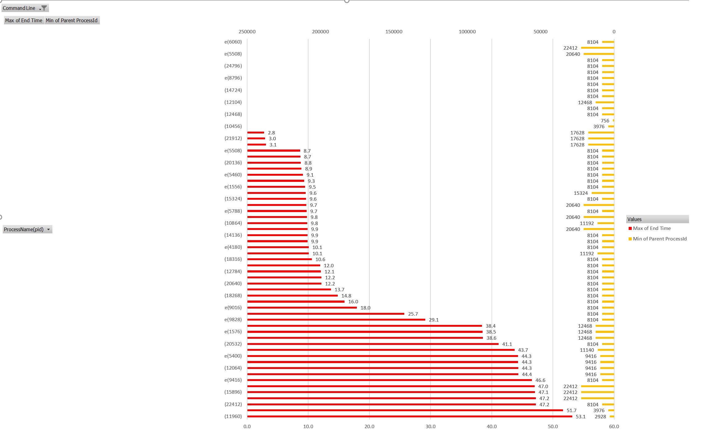

# ZeroTime

Image Source (https://eventhorizontelescope.org/press-release-april-10-2019-astronomers-capture-first-image-black-hole)

A common issue is to track performance relative a key event in the ETL file. Common scenarios are e.g. 
- UI visible after button click event was called
- UI visible after UI process has started
- New methods executed shortly before process has terminated (e.g. crashed)
- Exceptions that did happen after shutdown of application as requested
- Correlate distributed ETW traces
- ...

You can calculate relative timings manually but it is much easier to get that backed into your query. 

## Which events can be ZeroTime markers?
- First time a method was seen in one or any process
- Last time a method was seen in one or any process
- ETW Marker message
- Process start/end 

## How to move time?
The option *-ZeroTime/zt* allows you to do that. If the filter is not unique you can additionally add *-ZeroProcessName/zpn* to limit the zero time
definition to a specific process. 

| ZeroTime Option| Meaning |
| -----------  | ----------- 
| Marker       filter   |  Select a specific ETW Marker message e.g \*TestStart\* as zero time
| First        filter   |  Select first occurrence of method e.g. \*OnClick\* as zero time|
| Last         filter   |  Select last occurrence of method e.g. \*OnClick\* as zero time
| ProcessStart [CmdLine]|  Select the process start time as zero time. Needs -ZeroProcessName to filter for process name. The CmdLine filter is optional.
| ProcessEnd   [CmdLine]|  Select the process exit time as zero time. Needs -ZeroProcessName to filter for process name. The CmdLine filter is optional.

The following commands support -ZeroTime 
- -Dump CPU used with *-FirstLastDuration s s* to view shifted First/Last timings. 
- -Dump Process used with *-TimeFmt s* to view shifted process start/stop timings.
- -Dump Exception used with *-TimeFmt s* to view shifted exception times
- -Dump Mark

## Examples

### First Occurrence of Method as Zero
The following example selects the method *TestDeserialize* as zero timepoint. The headlines of First and Last have got a \* 
to indicate that the times are shifted.
To get meaningful output we sort by *First* and select all methods which were seen between the time interval [0;2]s and
have at least 50ms of CPU time to reduce the output. 

The -0.000 time is a rounding error because we just show ms and a time of e.g. -0.0004 
is rounded down to -0.000. Floating point numbers have a -0 and a +0. 

<table class=MsoTableGrid border=1 cellspacing=0 cellpadding=0
 style='border-collapse:collapse;border:none'>
 <tr style='height:310.7pt'>
  <td width=1685 valign=top style='width:1264.05pt;border:solid windowtext 1.0pt;
  background:black;padding:0in 5.4pt 0in 5.4pt;height:310.7pt'>
  
c:\&gt;ETWAnalyzer
  %f% -dump cpu -pn SerializerTests -methods * -fld s s -ZeroTime first
  *.TestDeserialize -sortby first -minmaxfirst 0 2.0 -minmaxcpums 50 
        CPU ms     Wait ms Last-First First(s*) Last(s*) Method 
  12/7/2021 10:58:16 AM
  CallupAdhocWarmReadingCT_3117msDEFOR09T121SRV.20200717-124447 
     SerializerTests.exe(22416) +- SerializerTests  -Runs 1 -N 1000000 -test combined
  -serializer XmlSerializer 
       1835 ms      899 ms   
  1.980 s   -0.000    1.980 SerializerTests.TestBase`2[System.__Canon,System.__Canon].TestDeserialize 
       1731 ms       79 ms    1.869 s    0.105    1.975
  SerializerTests.TestBase`2+&lt;&gt;c__DisplayClass39_0[System.__Canon,System.__Canon].&lt;TestDeserialize&gt;b__0 
       1731 ms       79 ms    1.869 s    0.105    1.975
  SerializerTests.TestBase`2[System.__Canon,System.__Canon].TestDeserializeOnlyAndTouch 
       1729 ms       79 ms    1.869 s    0.105    1.975
  SerializerTests.Serializers.XmlSerializer`1[System.__Canon].Deserialize 
       1727 ms       79 ms    1.867 s    0.107    1.975
  Microsoft.Xml.Serialization.GeneratedAssembly.XmlSerializationReaderBookShelf.Read4_BookShelf 
       1725 ms       79 ms    1.865 s    0.109    1.975
  Microsoft.Xml.Serialization.GeneratedAssembly.XmlSerializationReaderBookShelf.Read3_BookShelf 
       1709 ms       79 ms    1.864 s    0.110    1.975
  Microsoft.Xml.Serialization.GeneratedAssembly.XmlSerializationReaderBookShelf.Read2_Book 
        258 ms        0 ms    1.740 s    0.234    1.975 System.Marvin.ComputeHash32 
        294 ms        0 ms    1.723 s    0.251    1.975 System.Xml.NameTable.Get 
        359 ms        0 ms    1.719 s    0.253    1.972
  System.Xml.XmlTextReaderImpl.ParseElementContent 
        155 ms        0 ms    1.484 s    0.470    1.954
  System.Xml.XmlTextReaderImpl.ParseElement 
        283 ms        7 ms    1.497 s    0.471    1.968
  System.Xml.XmlReader.ReadElementContentAsString 
        271 ms        0 ms    1.500 s    0.474    1.975
  System.Xml.XmlTextReaderImpl.GetAttribute 
         83 ms        7 ms    1.479 s    0.476    1.955
  System.Xml.XmlReader.InternalReadContentAsString 
         64 ms        0 ms    1.476 s    0.478    1.954 System.Xml.NameTable.Add 
        630 ms       72 ms    1.489 s    0.483    1.972
  System.Xml.Serialization.XmlSerializationReader.ReadByteArray 
        105 ms        0 ms    1.460 s    0.494    1.954
  System.Xml.XmlReader.FinishReadElementContentAsXxx 
         80 ms        0 ms    1.469 s    0.499    1.968
  System.Xml.XmlReader.SetupReadElementContentAsXxx 
        122 ms        0 ms    1.467 s    0.500    1.967 System.Xml.Serialization.XmlSerializationReader.GetXsiType 
        158 ms        0 ms    1.468 s    0.506    1.975
  System.Xml.Serialization.XmlSerializationReader.ReadNull 
        156 ms        0 ms    1.468 s    0.506    1.975
  System.Xml.Serialization.XmlSerializationReader.GetNullAttr 
         60 ms        0 ms    1.444 s    0.521    1.965
  System.Xml.XmlTextReaderImpl.ParseText

  
&nbsp;

  </td>
 </tr>
</table>

The same data will also show up if it is exported to a CSV file with the -csv option.

### Process Start/Stop relative to marker method
Another example is to visualize shutdown behavior of a multi process application relative to the method *ShowShutdownWindow*

>ETWAnalyzer.exe -dump process -zerotime first *ShowShutdownWindow*  -timefmt s -csv Shutdown.csv

With an Excel Pivot Chart you get a nice visualization when processes did terminate relative to the shutdown trigger method along with their parent processes.

### Multi File correlation

You can also correlate multiple ETL files which were recorded from different machines at the same time.
Normally you have some key method which starts something in the frontend and some other method on the backend which 
is called shortly afterwards. You can then define two zero markers for multiple files where only the first matching 
marker will be applied. 

>ETWAnalyzer -dump CPU -ZeroTime First \*FrontendClick\*;\*BackendStartDownload\* -ZeroProcessName FE.exe;BE.exe -timefmt s -ProcessName FE.exe;BE.exe 

Or if you did emit marker events you can use them as well das zero point

>ETWAnalyzer -dump CPU -ZeroTime Marker \*FrontendClick\*;\*BackendStartDownload\*  -timefmt s -ProcessName FE.exe;BE.exe 

This works in principle with any number of ETW traces from any number of machines if you can identify by manual ETW analysis correlation events.
